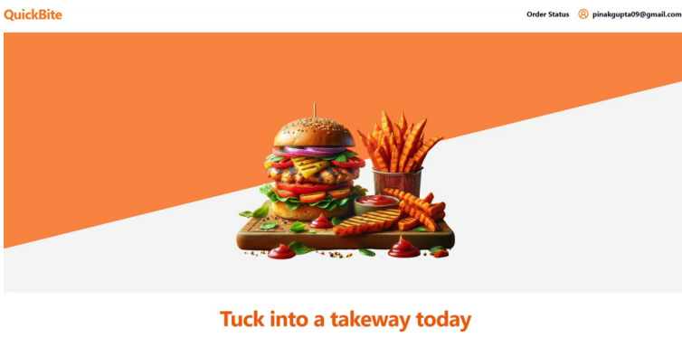
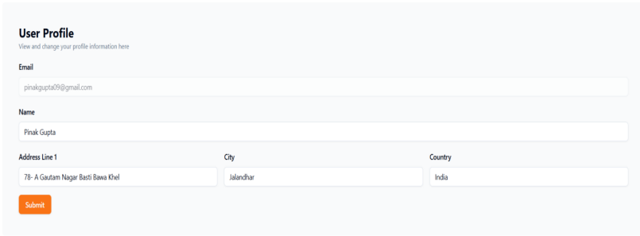
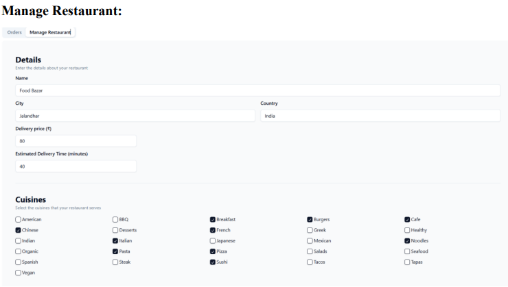
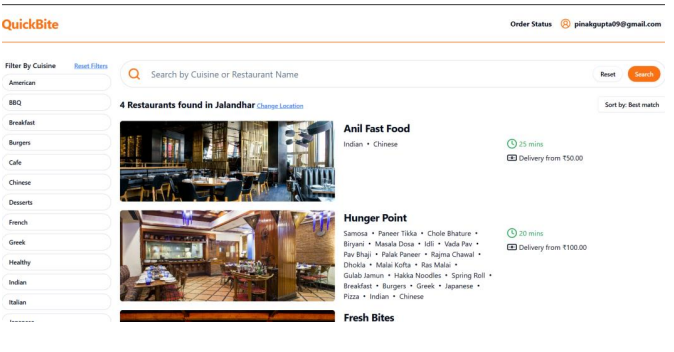
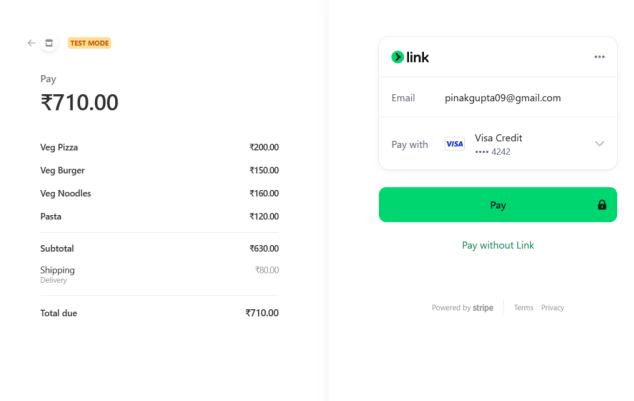

# QuickBite🍴

Welcome to **QuickBite**, a platform that connects food lovers with their favorite restaurants effortlessly. This repository contains the **frontend** implementation of the project.

For the **backend repository**, please visit: [QuickBite Backend](https://github.com/PinakGupta/QuickBite-backend)

---

## ✨ Features

- 🌐 **Responsive Design**: Optimized for all devices, ensuring a seamless user experience.
- 🎨 **Attractive UI**: Modern and visually appealing user interface.
- 🏢 **Restaurant Registration**: Restaurants can register to showcase their menu and services.
- 👥 **User Registration and Food Orders**: Users can sign up, browse menus, and place orders effortlessly.
- 🔍 **Search Bar with Filters**: Search functionality with advanced filters such as location, cuisine, and more.
- 💳 **Stripe Payment Gateway**: Fully integrated and secure end-to-end payment system using Stripe.


---

## 🛠️ Technologies Used

- **React.js** ⚛️: For building the user interface
- **Redux** 🗂️: For state management
- **Node.js** 🟢: Backend runtime environment
- **Express.js** 🚀: Backend framework
- **MongoDB** 🍃: NoSQL database for storing data
- **Material-UI** 🎨: For modern, customizable components
- **Stripe API** 💳: For secure payment processing
- **Auth0** 🔒: For robust authentication
- **Cloudinary** ☁️: For image storage and management

---

## 🖼️ Screenshots

### 🏠 Homepage


### 👤 User Profile


### 🏢 Restaurant Profile


### 🔍 Search Bar Landing Page


### 💳 Payment Landing Page

---

## 🚀 Getting Started

### Prerequisites

- Node.js (v14 or later)
- npm or yarn

### Installation

1. Clone this repository:

   ```bash
   git clone https://github.com/PinakGupta/QuickBite-frontend.git
   ```

2. Navigate to the project directory:

   ```bash
   cd QuickBite-frontend
   ```

3. Install dependencies:

   ```bash
   npm install
   ```

4. Start the development server:

   ```bash
   npm start
   ```

   The app will be available at [http://localhost:3000](http://localhost:3000).

---

## 🤝 Contributing

Contributions are welcome! Please follow these steps:

1. Fork the repository.
2. Create a new branch (`git checkout -b feature-branch`).
3. Make your changes and commit (`git commit -m 'Add some feature'`).
4. Push to the branch (`git push origin feature-branch`).
5. Create a pull request.

---

## 📜 License

This project is licensed under the [MIT License](LICENSE).

---

## 🙌 Acknowledgements

- Stripe API for secure payment processing.
- Auth0 for authentication services.
- Cloudinary for image storage.
- Open source libraries and frameworks that made this project possible.

---

Feel free to open issues or suggest improvements. Enjoy using QuickBite! 🍽️
